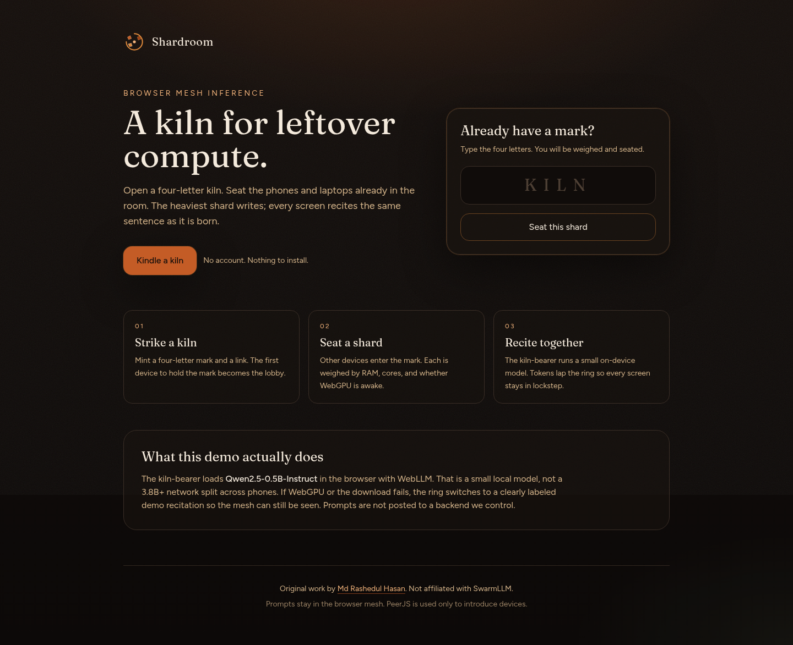
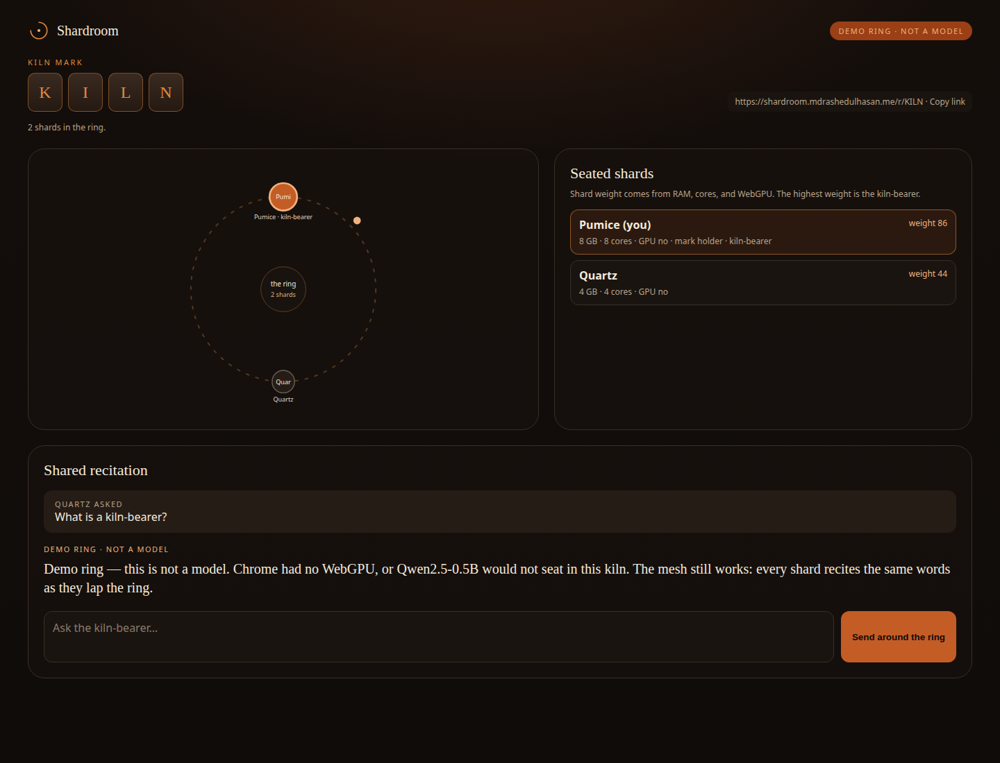

# Shardroom

A kiln for leftover compute.

Shardroom is a browser app where everyday devices join a room with a **four-letter mark**, sit in a WebRTC mesh, and **recite the same words as they appear**. Each device is weighed (RAM, WebGPU, cores). The strongest shard — the *kiln-bearer* — runs a **small in-browser model**. Tokens are broadcast around the ring so every screen stays in lockstep.

This is original work by [Md Rashedul Hasan](https://www.mdrashedulhasan.me).

## Honest scope

This demo runs **Qwen2.5-0.5B-Instruct** (WebLLM id `Qwen2.5-0.5B-Instruct-q4f16_1-MLC`) on the kiln-bearer. It coordinates devices over WebRTC. It does **not** tensor-parallel a 3.8B+ model across phones.

If WebGPU is missing or the model will not load, the kiln-bearer switches to a **labeled demo ring** that still streams words around the mesh so the UX can be shown. Live mode never silently fakes a model.

Prompts stay in the browsers that joined the kiln. There is no prompt backend. The only third party on the happy path is [PeerJS](https://peerjs.com) cloud signaling, which exchanges connection handshakes — not your words. No API keys are required.

## Screenshots

Landing — strike a kiln or seat a shard with a four-letter mark:



In-room — the ring, shard weights, kiln-bearer, and shared recitation:



## How a kiln works

1. **Strike a kiln.** Open the site and choose *Kindle a kiln*. You receive a four-letter mark and a URL such as `/r/KILN`.
2. **Seat a shard.** On another phone or laptop, type the mark or open the share link. No account. Each device probes RAM, cores, and WebGPU and publishes a *shard weight*.
3. **Elect a kiln-bearer.** The highest weight loads Qwen2.5-0.5B in the browser. Everyone else listens.
4. **Recite together.** Anyone can send a prompt. Generated tokens lap the ring visualization and appear on every screen at once.

Join path: landing form, `/r/ABCD`, or the Python CLI.

## Web app

Requires Node 20+.

```bash
npm install
npm run dev
```

Open [http://localhost:3000](http://localhost:3000).

```bash
npm run typecheck
npm run build
npm start
```

Force the labeled demo ring (useful on machines without WebGPU):

```
http://localhost:3000/r/KILN?demo=1
```

## Python CLI

```bash
pip install -e ./cli
shardroom create          # prints CODE and URL
shardroom join ABCD       # prints URL and opens a browser
shardroom join ABCD --print-only
```

Override the origin (default `https://shardroom.mdrashedulhasan.me`):

```bash
SHARDROOM_ORIGIN=http://localhost:3000 shardroom create
```

## Deploy on Vercel

No secrets are required for the happy path.

1. Fork or push this repository.
2. [Import the project in Vercel](https://vercel.com/new). Framework: Next.js. Build command `npm run build`. Output: default.
3. Deploy. The site will be reachable at `https://<project>.vercel.app`.
4. For the custom domain `shardroom.mdrashedulhasan.me`, add the domain in Vercel and create a **CNAME** at `shardroom` pointing to `cname.vercel-dns.com` (or the target Vercel shows).

`vercel.json` sets COOP/COEP `credentialless` headers so the in-browser runtime can use modern workers where available.

Optional, off by default: you may later point a hosted model at an env var of your own. The shipped demo does not call a third-party LLM API.

## Privacy

- No accounts.
- Prompts and tokens travel on the WebRTC data channels between the devices in the kiln.
- PeerJS is used only so devices can find each other.
- This project does not store prompts on a server we control.

## License

MIT. Copyright © 2026 Md Rashedul Hasan.
